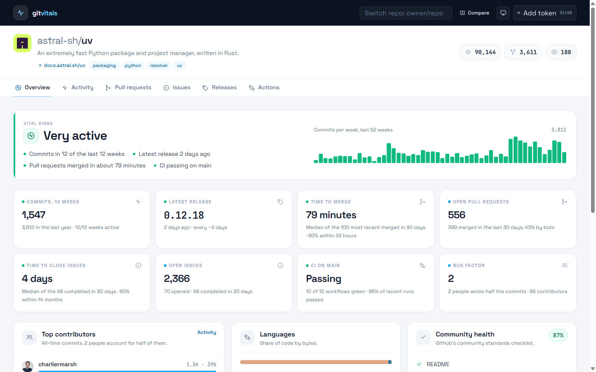

# gitvitals

[](https://github.com/EddieDavison92/gitvitals/actions/workflows/ci.yml)
[](LICENSE)

Vital signs for any GitHub repository: whether it's maintained, how quickly it merges and ships, who builds it and whether CI is green. It runs in your browser against the GitHub API, with no backend, account or install.

**[gitvitals-app.vercel.app](https://gitvitals-app.vercel.app)**

<picture>
  <source media="(prefers-color-scheme: dark)" srcset="docs/overview-dark.png">
  
</picture>

## Usage

- Enter `owner/repo` or paste any GitHub URL on the home page.
- Or swap `github.com` for the app's address in a repo URL. GitHub paths map to the matching tab: `/pulls`, `/issues`, `/releases`, `/actions` (including `/actions/runs/<id>`, which opens that run) and `/graphs/…` or `/pulse` for activity.
- Compare repositories at `/compare?repos=owner/a,owner/b` (up to four).

## What it shows

| Tab | Contents |
|---|---|
| **Overview** | Activity verdict (very active to dormant) with its reasons; cards for commits, latest release and cadence, time to merge, open PRs, time to close issues, open issues, CI on the default branch and bus factor; top contributors, languages, community checklist, recent releases. |
| **Activity** | Commit calendar, commits per week, when people commit (weekday × hour), code churn, full contributor list. |
| **Pull requests** | Open and merged counts, time to merge, merge rate, share from outside contributors and bots, PRs opened per day or week by outcome, who opens them, oldest open, recently merged. |
| **Issues** | Open, opened and completed counts, time to close, not-planned share, issues opened by outcome, open issue labels and ages, who opens them, oldest open, most discussed. |
| **Releases** | Latest and latest stable, typical gap, downloads, a timeline coloured by semver bump, gaps and downloads per release, release table. |
| **Actions** | CI health on the default branch, recent failures with the failed step and error annotations, reliability by workflow, trends, run explorer, and a run drawer with jobs, steps and timings. Polls faster while runs are active. |
| **Traffic** | Views, clones, referrers and popular pages. Shown only when your token can push to the repo. |

Light and dark themes follow your system, or can be set with the header toggle.

## How it works

The browser calls the [GitHub REST API](https://docs.github.com/en/rest) directly; Next.js only serves the pages.

- Each dataset (repo metadata, commit stats, contributors, releases, pull requests, issues, search counts, workflow runs) is fetched on demand by the tab that needs it, mapped to a small shape and cached in `localStorage` with a time-to-live. Data for the eight most recently viewed repos is kept.
- **Search counts** (open issues, PRs merged in 30 days and so on) use GitHub's search API, which has its own limit (10 a minute anonymously, 30 with a token). Merge and close times come from the same searches, so they cover the last 30 days.
- **Statistics endpoints** (commit activity, punch card, participation) answer 202 while GitHub computes them; the app retries automatically. GitHub doesn't compute line counts for repos with 10,000+ commits.
- **Workflow runs** load in parallel pages, refresh incrementally and use conditional requests; authenticated 304 responses don't count against the rate limit.

## Rate limits and tokens

| | Anonymous | With token |
|---|---|---|
| Requests per hour | 60 per IP | 5,000 |
| Search requests per minute | 10 | 30 |
| Overview (first visit) | ~7 requests + 5 searches | same |
| Pull request and issue samples | 100 most recent | 300 most recent |
| Workflow runs per period | 300 | 1,000 |
| Private repos and traffic | No | Yes, where the token has access |

Click **Add token** in the header to add one. A [fine-grained token](https://github.com/settings/personal-access-tokens/new) with read-only access is enough. It's stored in your browser's `localStorage` and only sent to `api.github.com`.

## Metric definitions

- **Activity**: weeks with commits among the last 12. 10+ is very active, 6+ active, 1+ occasional. None in 12 weeks but some in the year is quiet; none all year is dormant.
- **Bus factor**: the fewest people (bots excluded) who account for half of all commits to the default branch.
- **Time to merge / close**: median time from opening to merge, or to close as completed (not "not planned").
- **CI on the default branch**: each workflow's latest run that passed or failed. Pull request runs and GitHub-managed dynamic runs are excluded.
- **Failed runs**: conclusion `failure`, `timed_out` or `startup_failure`. Skipped, cancelled and neutral runs are neither passes nor failures.

## Development

Requires Node.js 24.

```bash
npm install
npm run dev        # http://localhost:3000
npm test           # unit tests (Vitest)
npm run lint
npm run typecheck
npm run build
```

`AGENTS.md` covers the architecture, request budgets and guardrails. Pull requests run the same checks in CI and deploy a Vercel preview; `main` deploys to production.

## Licence

[MIT](LICENSE)
